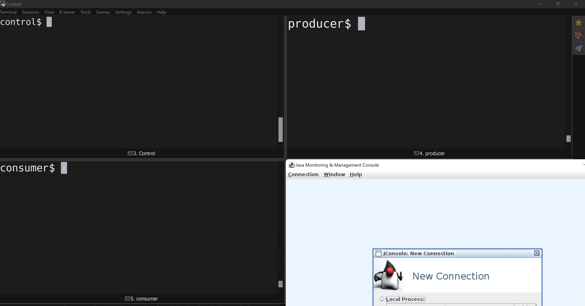

# Overview `request.timeout.ms` demo

In this demo we look at the Kafka producer config `request.timeout.ms`. The `request.timeout.ms` applies elsewhere among Kafka components too, but we're looking at some producer-specific behavior here. 

Producer [`request.timeout.ms`](https://docs.confluent.io/platform/current/installation/configuration/producer-configs.html#producerconfigs_request.timeout.ms) controls the maximum amount of time the producer client will wait for a response  from a Kafka broker. If the response is not received before the timeout elapses, then the client will resend the request if necessary or fail the request if `retries` are exhausted.

We'll specifically look at some producer behaviour when setting `request.timeout.ms` to a value that is too low.


# Setup 
To run the demo/tests below you need a Kafka cluster. I'm using a Standard Confluent Cloud cluster. Basic or Dedicated will work, as will a self-hosted cluster, just make sure you adjust your authentication configuration. 

Make a copy of `myClient.config.template`, rename it to `myClient.config` and populate it with your bootstrap server, your API Key (or username) and your API Secret (or password).

To keep the tests reasonably simple I'm using Kafka CLI tools `kafka-topics`, `kafka-console-consumer` and `kafka-producer-perf-test`. I'm using a dedicated terminal for each, a `Control terminal` ,`Producer terminal` and a `Consumer terminal`

The scripts in the `Consumer terminal` and in the `Control terminal` below expect the environment variable `BOOTSTRAP_SERVER` . Create it manually, or use something like this snippet to clip it from your `myClient.config`-file

```
export BOOTSTRAP_SERVER=$(grep bootstrap.server myClient.config | awk -F= '{print $2}')
```

Additionally I'll use `JConsole` to explore the producer JMX. This requires XForwarding. You can use a different way to explore the producer JMX if you like. Let me know if you have a suggestion for an elegant, minimal workflow**.

** One alternative is to run `kafka-producer-perf-test` with the `--print-metrics` argument. The big drawback is that you have to let it finish to see the metrics; the metrics won't show if you stop it using crtl-C. So you will have to choose a `--num-records` that is small enough to wait for...



## Establish connection, Create test/demo topic

In the `Control terminal` run the following two `kafka-topics` commands. The first will confirm that your `myClient.config` is in good shape and you have access to your cluster, the second will create the first test-topic.

```
kafka-topics --bootstrap-server $BOOTSTRAP_SERVER --command-config myClient.config --list

kafka-topics --bootstrap-server $BOOTSTRAP_SERVER --command-config myClient.config --create --topic producer-test
```

## Establish consumer
To ensure as-expected behaviour during the test I run a `kafka-console-consumer`. In the duplication tests below we rely on the console-consumer reporting the number of records consumed. So while this step is not strictly necessary in the first few tests, I _will_ use it later on. 

In your `consumer terminal` run:
```
kafka-console-consumer --bootstrap-server $BOOTSTRAP_SERVER --consumer.config myClient.config --group MyDemoConsumer --topic producer-test
```

## Establish Producer logging

To enable detailed and meaningful logging of the producer events I attach customised log4j logging options to the producer. 

I configure log4j to collect all DEBUG, INFO and WARN lines, and display all of them in the log file called `log.out`. I configure the console output to only display WARN level lines. Inspect the `[tools-log4j.properties](tools-log4j.properties)`-file to see the log4j config.

I apply these logging configs to the producer by setting the environment variable `KAFKA_LOG4J_OPTS` in the `Producer terminal`

```
export KAFKA_LOG4J_OPTS=-Dlog4j.configuration=file:tools-log4j.properties
```

## Run `kafka-producer-perf-test` producer
I use `cat` to join the shared configs from `myClient.config` and the producer-specific configs from `myAddedProducer.config` into the file `myCombinedProducer.config` that I pass to the `kafka-producer-perf-test`
```
cat myClient.config myAddedProducer.config > myCombinedProducer.config && \
kafka-producer-perf-test \
  --num-records 50000000 \
  --record-size 200 \
  --throughput 3000 \
  --producer.config myCombinedProducer.config \
  --topic producer-test
```

## Observing some producer metrics using JConsole

To find a suitable request latency to use in the failure tests below, I do the following:

Open JConsole, connect to the local process named `org.apache.kafka.tools.ProducerPerformance` and on the `MBeans`-tab navigate to the `kafka.producer` `producer-metrics` `perf-producer-client` category and select `Attributes`. Scroll down in the list of attributes on the right and expand `request-latency-avg` and `request-latency-max`. A graph will show for each. I want the graphs to settle into a somewhat horizontal trend. For the purpose of the failure tests below, I note down a value somewhere between the `request-latency-avg` and `request-latency-max`. Pro-tip: while waiting for the two `request-latency`-metrics to settle, scroll up and down and look at some of the other JMX metrics available from the producer.


```
jconsole&
```


# Experimental Steps

To demonstrate the workflow that I use during the failure tests below, I reconfigure the producer and restart the producer with these batching settings. 

## Batching, to test the experimental workflow

- Stop the producer
- Add the three batching configs (below) to the `myAddedProducer.config`-file. 
- Restart the producer. 
- In JConsole, close the old connection window (it will disconnect from the producer whe you stopped it above). Create a new connection to the new producer process. 
- Observe some of the changed metrics, e.g. `batch-size-avg`, `batch-size-max` and `compression-rate-avg`. 
- (stop the producer)
- Also observe the `log.out` file that shows the DEBUG log for the producer process. 

```
batch.size=300000
linger.ms=10
compression.type=gzip
```


## Failure scenario: low `request.timeout.ms`

In this first failure test I am going to generate some errors. I have noted down a suitable _request.latency_ in the setup above (section "Observing some producer metrics using JConsole"). I configure my producer to use a `request.timeout.ms` so near the current observed _request.latency_ that it will generate errors. 

I add the value I noted from the JMX earlier into the `myAddedProducer.config`-file. E.g. 
```
request.timeout.ms=600
```

I run the `kafka-producer-perf-test` using the same command I used above. I let it run for a few (20?) seconds, but then stop it. The console is showing many WARN-level errors. The log file `log.out`  is  collecting the INFO and DEBUG level errors on top of the WARN level ones. If you're not seeing errors, then it is likely that your `request.timeout.ms` isn't low enough. Try to adjust it down to see if you can make some errors. 

In a text editor I inspect `log.out`. Or use `grep`. 
- find and isolate the first `Cancelled in-flight PRODUCE`, note its correlation id `correlation id x`. Also note the "node being disconnected".
- find and isolate the corresponding produce request (use `correlationId=x`) (note the two different ways of referring to the correlation id. )

- find the corresponding WARN (NETWORK_EXCEPTION) with `correlation id x`. this is WARN level, so this is the only notfication that you'd see if operational logging is restricted to WARN. 

- Find the first METADATA Request and Response _after_ the first errors

- Find the node number of the disconnected node in the METADATA

- BONUS: It is often possible to find batches that were cancelled because they were in-flight to the same node that you noted above, _even though these batches haven't exceeded the `request.timout.ms` themselves._

### Reflection 
In-flight produce requests are cancelled when more than `request.timeout.ms` elapse before receiving a repsonse. If multiple requests were inflight to the same node, those requests will also be cancelled. The producer requests new metadata from the cluster when this happens, but this new metadata includes the disconnected node as long as the cluster thinks the node is healthy. 

## Duplication test

A side effect of the short `request.timeout.ms` failure above is an increased risk of message duplications. As a matter of fact: while I think it is theoretically possible that it _doesn't_ generate duplications, I have not observed this experimentally. _It just always does._


To demonstrate this:
- I create a new topic `producer-test2`
```
kafka-topics --bootstrap-server $BOOTSTRAP_SERVER --command-config myClient.config --create --topic producer-test2
```
- I stop (and clear) the producer in the Producer terminal
- I stop (and clear) the consumer in the Consumer terminal
- I restart the consumer _with the new topic_
```
kafka-console-consumer --bootstrap-server $BOOTSTRAP_SERVER --consumer.config myClient.config --group MyDemoConsumer --topic producer-test2
```


- I start the producer with a small maximum `--num-records` (e.g. 50000)
- Even though it generates errors. The producer is still soldiering on with the task of sending stuff to the broker. It typically _will_ finish. I give the producer some time to finish and at the end note the number of records it has produced when it has finished. 

```
cat myClient.config myAddedProducer.config > myCombinedProducer.config && \
kafka-producer-perf-test \
  --num-records 50000 \
  --record-size 200 \
  --throughput 3000 \
  --producer.config myCombinedProducer.config \
  --topic producer-test2
```

While waiting for the producer to finish, why not reconnect `JConsole` to the process, and navigate to the metrics called `record-error-rate` and `record-retry-rate`. 

Once the producer has finished, I head over to the consumer terminal, wait until it has finished consuming (no more new lines appearing). Then I stop the consumer (ctrl-c). It  will show a number of message it has just consumed. 

### Reflection 
I started with an empty topic `producer-test2`. I then produced exactly 50000 messages into it, albeit under conditions with lots of errors. The consumer consumed many more messages from the topic. Why are there more messages than the 50000 I produced?

The NETWORK_EXCEPTION is a retryable error. Under the given configuration the batches that are cancelled are retried. Note that the cluster is oblivious to the producer inflight request cancellations: this is purely a producer client-side event. So most likely the cluster will have received the data successfully in the first try. The Producer then cancels the inflight request before the cluster had time to respond. The producer sends the same data again as a retry, thereby duplicating the batch. 


## Acks=0 test
As with the duplications test, for this test it is necessary to start with a new topic. 

- Create a new topic `producer-test3`
```
kafka-topics --bootstrap-server $BOOTSTRAP_SERVER --command-config myClient.config --create --topic producer-test3
```
- Stop (and clear) the producer
- Stop (and clear) the consumer
- Restart consumer _with the new topic_
```
kafka-console-consumer --bootstrap-server $BOOTSTRAP_SERVER --consumer.config myClient.config --group MyDemoConsumer --topic producer-test3
```

Change acks setting in the config file. Set  `acks = 0` in `myAddedProducer.config`

```
cat myClient.config myAddedProducer.config > myCombinedProducer.config && \
kafka-producer-perf-test \
  --num-records 50000 \
  --record-size 200 \
  --throughput 3000 \
  --producer.config myCombinedProducer.config \
  --topic producer-test3
```

### Reflection
What did you observe in the producer console? How many messages did you produce? How many did you consume? What is the effect of `acks=0` on the error conditions from the tests above? What do you know of the effect of `acks=0` on durability?


## Enable Idempotence test
As with the duplications- and acks=0-tests, for this test it is necessary to start with a new topic.


```
kafka-topics --bootstrap-server $BOOTSTRAP_SERVER --command-config myClient.config --create --topic producer-test4
```

```
kafka-console-consumer --bootstrap-server $BOOTSTRAP_SERVER --consumer.config myClient.config --group MyDemoConsumer --topic producer-test4
```
In `myAddedProducer.config` set:
```
acks=all
enable.idempotence=true
```
Then run the producer again
```
cat myClient.config myAddedProducer.config > myCombinedProducer.config && \
kafka-producer-perf-test \
  --num-records 50000 \
  --record-size 200 \
  --throughput 3000 \
  --producer.config myCombinedProducer.config \
  --topic producer-test4
```

### Reflection
Enabling idempotence makes the producer add a little bit of data to each batch with which the cluster can determine whether it has already stored that batch. This prevents `retries` to result in message duplications. So it can use `retries` to help guarantee delivery, and it uses `idempotence` to prevent duplication. It requires that `acks=all` which trades off the improved durability against some produce latency. 

# Summary
In this demonstration I used the `kafka-producer-perf-test` tool to produce test data to a kafka cluster. I added log4j logging customization to enable inspecting increased log-levels. I used JConsole to inspect some relevant producer JMX metrics. 

I introduced a configuration that guaranteed network_exceptions, causing disconnects in the producer. 

I showed two scenarios to remove the duplication side effect from the error scenario. 

Note that the configuration of very low `request.timeout.ms` I introduced is counter best-practice. The default value is 30 seconds.

Setting very low `request.timeout.ms` in an attempt to enforce low latency causes producer overhead, increases wait times, adds cluster overhead, generates errors and it is likely to _increase_ produce request latency overall.  

To optimise towards low produce latency I think it is better to set up robust producer observability (e.g. a Prometheus, Grafana stack) and treat Producer Request latency in a statistical sense (use percentiles). Configure producers with a view to resilient behaviour (i.e. `retries`, default `request.timeout.ms`, default `delivery.timeout.ms`) and optimise your `acks` and batching configurations, partition strategy and perhaps cluser size to favour latency over your other service goals and achieve your latency objectives. 

